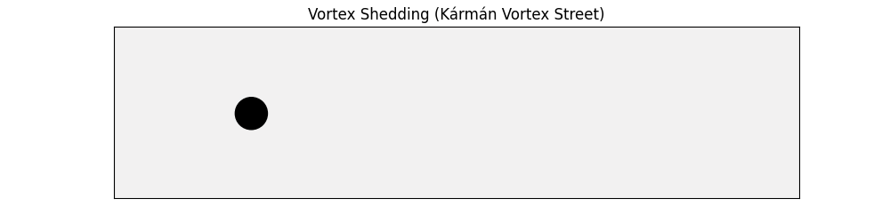
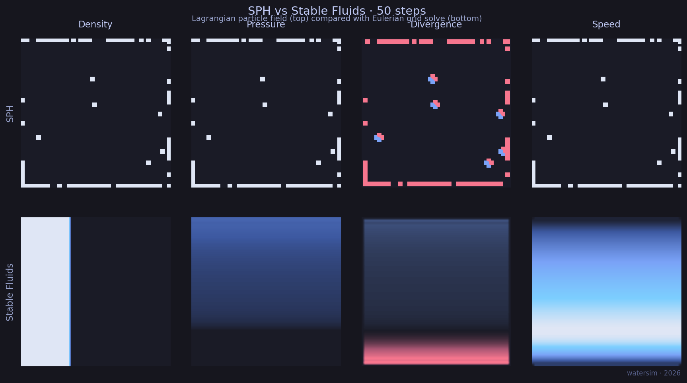

# 2D Fluid Dynamics Lab

[](https://www.python.org/)
[](LICENSE)
[](https://github.com/astral-sh/ruff)



A small lab for incompressible 2D fluid simulation. Three solvers are implemented from first principles in pure NumPy and SciPy: a Lagrangian smoothed-particle solver (SPH), an Eulerian semi-Lagrangian solver in the style of Stam's Stable Fluids, and a hybrid PIC/FLIP solver that mixes particle and grid representations. Every scene below was generated by these solvers running on a standard laptop with no GPU and no compiled extensions. The intent of this repository is pedagogical: each scene picks a phenomenon that highlights the strengths and limitations of one of the three methods, and the renderings are meant to make the underlying physics legible at a glance.

---

## Kármán Vortex Street


A horizontal stream flows past a circular cylinder embedded in the grid. Once the Reynolds number $Re = UD/\nu$ exceeds about 40, the boundary layer on the cylinder separates and the wake becomes unstable to a transverse mode that organises into the alternating-sign vortex train shown here. The non-dimensional shedding frequency is set by the Strouhal number $St = fD/U \approx 0.2$ in the Reynolds range relevant to this simulation. Visually, two clean rows of counter-rotating eddies should be peeling off the cylinder and convecting downstream, with the upper row turning one way and the lower row turning the other.

The colour field is a composite of dye concentration multiplied by the local sign of vorticity: dye that sits inside a clockwise eddy renders in cyan, dye inside a counter-clockwise eddy renders in orange, and dye in irrotational regions remains close to the background. This makes the alternating shedding pattern legible without overlaying arrows or streamlines. The solver itself is the Eulerian Stable Fluids scheme on a 192-cell-wide grid with open inflow/outflow boundaries on the left and right walls, a no-slip mask on the cylinder, and a small oscillating transverse kick applied just behind the cylinder to seed the symmetry breaking.

## Two-Source Swirl


Two density sources are injected at orbiting positions while opposite-sign vortical force pulses are applied at separate locations. The flow is purely passive: there is no obstacle, no gravity, and no boundary forcing. What you should see is two trailing density plumes that wrap around each other in a spiral, with the spiral arms eventually fragmenting into smaller filaments as the vorticity field stretches and folds the dye. This is a clean illustration of how a divergence-free velocity field reorganises a passive scalar without changing its integral over the domain.

This scene is a stress test for the Stable Fluids advection scheme. Semi-Lagrangian advection is unconditionally stable but only first-order accurate, so over many timesteps it artificially diffuses fine-scale structure: the spiral filaments would be sharper under a higher-order scheme. The cyan-to-magenta diverging colormap is centred on the background, so positive density (the injected dye) brightens toward cyan while small negative numerical artifacts pull toward magenta and stay visually subdued. The 128-cell grid keeps the run fast enough to iterate on the source kinematics interactively.

## PIC/FLIP Dam Break


A column of fluid is released against the left wall of a long basin and allowed to collapse under gravity. The expected behaviour, validated against the Martin and Moyce 1952 dam-break experiment, is a leading edge that races along the floor at roughly $\sqrt{2gH}$, a return wave that climbs the right wall and folds back, and eventually a turbulent slosh that fills most of the basin. Free-surface dynamics like this are exactly the regime where pure Eulerian methods struggle: tracking the air-water interface on a fixed grid requires either a level set or a volume-of-fluid scheme, both of which add complexity and dissipation.

The hybrid PIC/FLIP solver sidesteps the interface-tracking problem entirely. Each particle carries a velocity, particles are scattered to a background MAC grid (P2G), the grid enforces incompressibility through pressure projection, then the corrected velocity field is interpolated back to the particles (G2P). The FLIP update transmits only the *change* in grid velocity back to the particles, which preserves the small-scale kinetic energy that would otherwise be lost to advective diffusion. Pure FLIP is unstable in the long run, so the solver here is run at $\alpha = 0.95$, meaning 95% FLIP blended with 5% PIC for damping. Particles are rendered as small filled markers with a short fading trail to make the bulk motion readable.

## Rayleigh-Taylor Instability


A denser fluid is placed above a lighter one in a tall vertical channel. The configuration is hydrostatically unstable: any infinitesimal perturbation of the interface grows exponentially and reorganises the layers. The classical linear theory of Rayleigh and Taylor predicts a growth rate $n = \sqrt{Agk}$, where $A$ is the Atwood number, $g$ the gravitational acceleration, and $k$ the wavenumber of the perturbation, so short-wavelength modes initially grow fastest. Once the interface deforms by an amount comparable to the wavelength, the linear theory breaks down and the characteristic mushroom-cap spikes and bubbles develop, eventually undergoing secondary Kelvin-Helmholtz roll-ups along their stems.

The interface here is seeded with a sum of three sinusoidal modes (wavenumbers 3, 5 and 8) of decreasing amplitude with random phases. This multi-mode seed produces a more physical late-time appearance than a single-mode initial condition, because no single wavelength dominates the cascade. The solver is Stable Fluids on a 192 by 384 grid with a constant downward body force proportional to the local density. The colour field uses a cyan-to-magenta split that traces the original layer of each fluid parcel, so the mixing zone is visible as gradient interpolation between the two colours.

## Lid-Driven Cavity


A square cavity has a no-slip floor and side walls; the top wall slides at a constant velocity $U$. The lid drags fluid along with it, that fluid is deflected by the right wall, descends, returns along the bottom, and rises along the left wall, producing a single dominant primary vortex that fills the cavity. At higher Reynolds numbers, secondary Moffatt eddies appear in the bottom corners and a tertiary structure develops in the upper-left corner. The Ghia, Ghia and Shin 1982 paper publishes reference velocity profiles along the vertical and horizontal centrelines for a range of Reynolds numbers, and these have been the canonical incompressible-solver benchmark for forty years.

The colour field is the speed magnitude $|\mathbf{u}|$ on a sequential dark-to-cyan colormap, with streamlines redrawn every thirty frames to keep the animation file size reasonable. The streamlines make the primary vortex centre and the secondary corner structures visible without obscuring the speed field underneath. The simulation is Stable Fluids at $Re = UL/\nu \approx 38{,}400$, which is past the steady regime: at this Reynolds number the flow is unsteady and the corner eddies oscillate, which is exactly what should be visible toward the end of the animation.

## SPH vs Stable Fluids (Static)



A side-by-side snapshot of the same initial condition (a dam of fluid occupying the left third of a 64 by 64 domain, falling under gravity) evolved for fifty timesteps by each of the two solvers. Four fields are shown: density, pressure, divergence, and speed magnitude. Each panel uses its own per-cell colour normalisation so structure remains visible even when the SPH and Stable Fluids fields differ in absolute scale.

The contrast is the point of the figure. The SPH row shows a discrete particle field where density piles up at the boundary and pressure spikes appear locally where particles cluster: this is the Lagrangian view of the same physics. The Stable Fluids row shows smooth, grid-resolved fields where the density block has spread under the body force, the pressure gradient that drives that motion is clearly visible, and the divergence and speed fields show the projected, divergence-free flow at every cell. Neither view is "correct"; they are dual descriptions of the same continuum.

---

## Installation

```bash
git clone https://github.com/IsolatedSingularity/Water-Simulations
cd Water-Simulations
pip install -r requirements.txt
```

Python 3.11 or later. No GPU, no compiled extensions.

## Running Simulations

All scripts are thin entry points under `scripts/`. Run from the repo root:

```bash
python -m scripts.runKarmanStreet      # Kármán vortex street
python -m scripts.runSavedSwirl        # Two-source swirl
python -m scripts.runPicFlipDamBreak   # PIC/FLIP dam break
python -m scripts.runRayleighTaylor    # Rayleigh-Taylor instability
python -m scripts.runLidDrivenCavity   # Lid-driven cavity
python -m scripts.runStaticAnalysis    # SPH vs Stable Fluids static comparison
python -m scripts.runRealtime          # Interactive Stable Fluids (mouse input)
```

Output is written to `Plots/`. Run time is roughly 1 to 5 minutes per script on a standard laptop.

```bash
python -m pytest tests/ -q             # 18 unit and smoke tests
```

## Project Structure

```
watersim/
  solvers/        SPH, Stable Fluids, PIC/FLIP, abstract base
  scenes/         Per-scene setup + rendering (one file per scene)
  viz/            Theme, colour palettes, animation wrapper
  config.py       Dataclass-based scene configs
scripts/          Thin entry points
tests/            pytest suite
docs/             Per-solver theory and implementation notes
Plots/            Generated GIFs and PNGs
```

---

## Theory

All three solvers model an incompressible Newtonian fluid in two dimensions. The governing equations are the incompressible Navier-Stokes system:

$$\frac{\partial \mathbf{u}}{\partial t} + (\mathbf{u} \cdot \nabla)\mathbf{u} = -\frac{\nabla p}{\rho} + \nu \nabla^2 \mathbf{u} + \mathbf{f}, \qquad \nabla \cdot \mathbf{u} = 0.$$

The first equation is Newton's second law for a fluid parcel: inertia and convective acceleration on the left, pressure gradient, viscous diffusion, and body forces on the right. The second is the incompressibility constraint, which forces the velocity field to be divergence-free everywhere.

### Pressure Projection

The hard part of incompressible simulation is enforcing $\nabla \cdot \mathbf{u} = 0$ at every step. The standard approach uses the Helmholtz decomposition: any vector field $\mathbf{w}$ can be split uniquely into a divergence-free part and a gradient,

$$\mathbf{w} = \mathbf{u} + \nabla p.$$

Taking the divergence and using $\nabla \cdot \mathbf{u} = 0$ gives the Poisson equation $\nabla^2 p = \nabla \cdot \mathbf{w}$. Solving for $p$ (here by Gauss-Seidel relaxation) and subtracting $\nabla p$ from $\mathbf{w}$ yields the projected, divergence-free velocity. This is the projection step in both `StableFluidsSolver` and `HybridSolver`.

### Stable Fluids (Eulerian)

Stam's contribution was a semi-Lagrangian advection scheme that is unconditionally stable. Rather than pushing fluid forward, each grid cell is traced backward along the velocity field:

$$\phi^{n+1}(\mathbf{x}) = \phi^n\bigl(\mathbf{x} - \mathbf{u}\,\Delta t\bigr).$$

The new value at $\mathbf{x}$ is the old value at the back-traced position, sampled by bilinear interpolation. This removes the CFL constraint and allows large timesteps. The cost is first-order accuracy and noticeable numerical dissipation, which is why vortical structures decay over long runs.

### SPH (Lagrangian)

SPH replaces the continuum with a set of particles, each carrying mass, position, velocity, and pressure. Any field $A$ can be reconstructed at any point by a kernel-weighted sum over neighbours:

$$A(\mathbf{r}) = \sum_j \frac{m_j}{\rho_j} A_j \, W(|\mathbf{r} - \mathbf{r}_j|, h).$$

The Poly6 kernel is used for density estimation,

$$W_{\mathrm{poly6}}(r^2, h) = \frac{315}{64\pi h^9}(h^2 - r^2)^3,$$

and the gradient of the Spiky kernel is used for pressure forces because its non-zero gradient at $r = 0$ prevents particle clumping. Pressure is closed by a Tait equation of state $p_i = k(\rho_i - \rho_0)$. Neighbour queries use `scipy.spatial.cKDTree` for $\mathcal{O}(N \log N)$ lookup.

### PIC/FLIP (Hybrid)

Pure Lagrangian methods handle free surfaces naturally but struggle with incompressibility; pure Eulerian methods enforce incompressibility cheaply but suffer advective diffusion. PIC/FLIP keeps particles as the primary representation but borrows the grid only for the projection step. The FLIP update transmits the *change* in grid velocity back to the particles,

$$\mathbf{v}_p^{n+1} = \alpha\bigl(\mathbf{v}_p^n + \Delta\mathbf{v}_{\mathrm{grid}}\bigr) + (1-\alpha)\,\mathbf{v}_{\mathrm{grid}}^{n+1},$$

so $\alpha = 0.95$ gives 95% FLIP (energetic, detail-preserving) blended with 5% PIC (damping, stabilising). The P2G scatter uses `np.add.at` for vectorised bilinear accumulation on a staggered MAC grid.

### References

- Stam, J. (1999). *Stable Fluids*. SIGGRAPH 99.
- Müller, M., Charypar, D., & Gross, M. (2003). *Particle-Based Fluid Simulation for Interactive Applications*. SCA 2003.
- Zhu, Y. & Bridson, R. (2005). *Animating Sand as a Fluid*. SIGGRAPH 2005.
- Ghia, U., Ghia, K.N., & Shin, C.T. (1982). *High-Re Solutions for Incompressible Flow Using the Navier-Stokes Equations and a Multigrid Method*. J. Comput. Phys. 48.
- Sharp, D.H. (1984). *An overview of Rayleigh-Taylor instability*. Physica D 12.
- Martin, J.C. & Moyce, W.J. (1952). *Part IV. An experimental study of the collapse of liquid columns on a rigid horizontal plane*. Phil. Trans. R. Soc. A 244.
