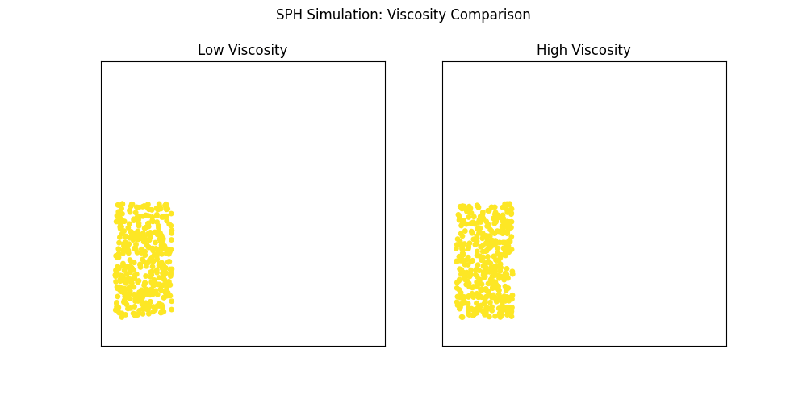
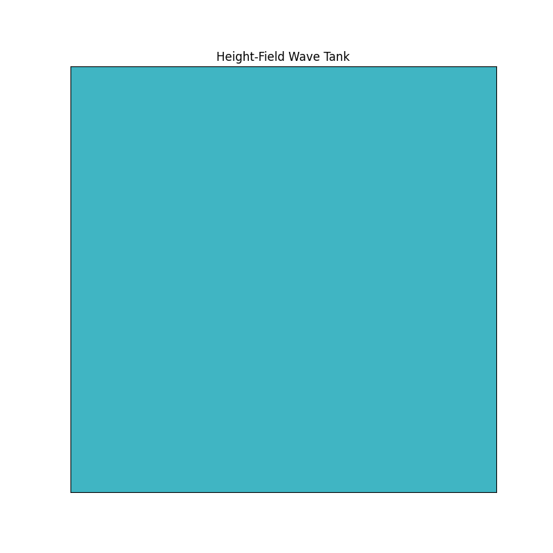

# 2D Water Simulation Framework

This project explores and implements several popular techniques for simulating 2D water and fluid dynamics. It provides implementations of particle-based (SPH), grid-based (Stable Fluids), and hybrid (PIC/FLIP) methods, each with unique strengths and applications.

The goal is to provide a clear, hands-on comparison of these different approaches, from static analysis to real-time interaction and advanced, offline animation generation.

## Simulation Techniques Implemented

### 1. **Smoothed Particle Hydrodynamics (SPH)**
A Lagrangian method where the fluid is modeled as a collection of particles. It excels at creating dynamic, splashy effects and handling complex free surfaces.
-   **Used in:** `static_analysis.py`, `advanced_simulations.py` (Viscosity Comparison)

### 2. **Stable Fluids (Eulerian Grid)**
An Eulerian method where fluid properties are stored on a fixed grid. It is unconditionally stable and computationally efficient, making it perfect for real-time applications.
-   **Used in:** `static_analysis.py`, `realtime_simulation.py`, `save_animation.py`

### 3. **Hybrid PIC/FLIP**
A method that combines particles (for carrying velocity and reducing diffusion) with a grid (for efficient pressure solves). This approach provides a "best of both worlds" solution, yielding highly detailed and realistic fluid motion.
-   **Used in:** `hybrid_simulation.py`

### 4. **Advanced Demonstrations**
The `advanced_simulations.py` script showcases more specific fluid phenomena:
-   **Vortex Shedding:** Simulates the classic Kármán vortex street that forms when a fluid flows past an obstacle.
-   **Height-Field Waves:** A simplified but effective method for simulating surface waves, like ripples in a pond.

---

## Gallery

A collection of the plots and animations generated by the simulation scripts.

### Static Analysis: SPH vs. Stable Fluids
A side-by-side comparison of fluid density, pressure, and velocity divergence in a dam break scenario.


### Saved Stable Fluids Animation
A non-interactive animation showing two swirling fluid sources, generated by `save_animation.py`.


### Hybrid PIC/FLIP Simulation
A high-quality animation of a dam break using the advanced hybrid method, demonstrating realistic splashing and fluid momentum from `hybrid_simulation.py`.


### Viscosity Comparison (SPH)
A comparison of two SPH simulations with low and high viscosity fluids.



### Vortex Shedding (Kármán Vortex Street)
An animation showing the formation of alternating vortices behind a solid cylinder.


### Wave Tank Simulation
An animation of propagating surface waves generated by multiple oscillating sources.



---

## How to Run the Simulations

All scripts should be run from the root directory of the project.

### 1. Static Analysis
Generates the `static_comparison.png` image in the `Plots/` directory.
```bash
python Code/static_analysis.py
```

### 2. Real-Time Interactive Simulation
Opens a window for you to interact with the fluid. Click and drag the mouse to add density and forces.
```bash
python Code/realtime_simulation.py
```

### 3. Save Swirling Animation
Generates the `saved_simulation.gif` animation in the `Plots/` directory.
```bash
python Code/save_animation.py
```

### 4. Hybrid PIC/FLIP Simulation
Generates the high-quality `hybrid_simulation.gif` in the `Plots/` directory. This is computationally intensive and may take some time.
```bash
python Code/hybrid_simulation.py
```

### 5. Advanced Simulations
Generates the three advanced simulation GIFs: `vortex_street.gif`, `viscosity_comparison.gif`, and `wave_tank.gif`.
```bash
python Code/advanced_simulations.py
``` 